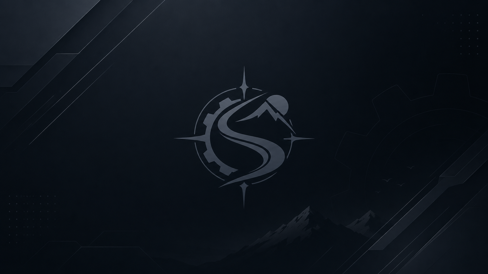
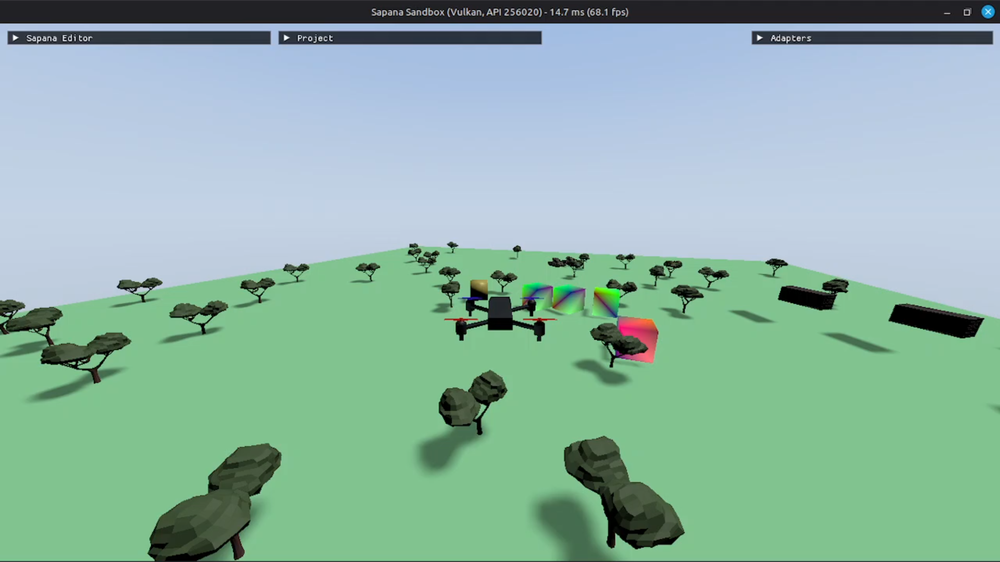
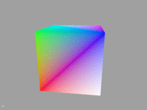

<p align="center">
  
</p>

<h1 align="center">Sapana Engine</h1>

<p align="center">
  A lightweight custom C++ game engine built for a specific game,<br/>
  designed to run on hardware with limited graphics memory.
</p>

<p align="center">
  <a href="https://youtu.be/nsptiy-I4Ps">Watch the demo on YouTube</a>
</p>

---

## What is this

I wanted to build a game, but I also wanted to understand how engines actually work under the hood. Full engines like Unreal or Godot felt like too much abstraction, and writing a raw Vulkan renderer from scratch would have taken forever before I could even place a cube on screen. So I went with a middle ground: [Diligent Engine](https://github.com/DiligentGraphics/DiligentEngine) as the rendering abstraction, and built everything else myself - ECS, scene loading, physics integration, cameras, input, flight sim, the works.

The other constraint was practical: I needed this to run on my old laptop with an Intel HD 620 (integrated graphics, no discrete GPU). That shaped a lot of decisions - keeping draw calls low, using distance culling aggressively, and not pulling in heavy middleware.

This builds and runs on both **Linux** (tested on Mint 22.3) and **Windows** (separate `win` branch).

<p align="center">
  
</p>

---

## Why Diligent Engine

| Approach | Trade-off |
| --- | --- |
| Full custom renderer (raw Vulkan) | Too slow to reach a shippable game |
| Full existing engine (Godot / Unreal) | No real engine-building experience |
| **Diligent Engine (middle tier)** | Real GPU/pipeline understanding without hand-rolling Vulkan sync primitives |

Diligent is a dependency, not the codebase. It gives me modern pipeline state objects, resource binding, and HLSL as the universal shading language - targeting Vulkan, D3D12, D3D11, Metal, and OpenGL. I write the engine logic; Diligent handles the graphics API.

---

## What I built

Here is what the engine currently has, layer by layer:

### ECS & scene system
- Entity-component system using [EnTT](https://github.com/skypjack/entt)
- Scenes are authored as JSON files - entities with transforms, mesh references, physics properties, and LOD groups
- `SceneLoader` parses the JSON at startup and populates the ECS registry
- Components: `Name`, `Transform` (position / Euler / quaternion / scale), `MeshRenderer`, `LodGroup`, `Visibility`

### Asset loading
- GLB/glTF mesh loading via Diligent's GLTF loader, wrapped in my own `GltfMeshLoader` and `AssetCache`
- Builtin procedural primitives (cube, plane) for quick prototyping
- Assets are identified by string IDs: `builtin:cube`, `builtin:plane`, or file paths like `meshes/drone.glb`

### Rendering
- **Two render modes**, switchable via `config/renderer.json`:
  - `Basic` - forward-rendered position+color meshes with optional PCF shadow reception
  - `PBR` - physically based rendering using Diligent's GLTF_PBR_Renderer (wrapped behind pimpl)
- **Procedural sky** - fullscreen gradient (zenith / horizon / ground blend), configurable falloff, no skybox texture needed
- **Shadow mapping** - cascaded shadow maps via Diligent's ShadowMapManager, depth-only caster pass, 5-tap PCF sampling
- **Frustum culling & LOD** - `VisibilityAndLodSystem` runs per frame: frustum test, distance-based LOD switching (level 0 → level 1), and far-distance culling with hysteresis to reduce popping

### Physics (Jolt)
- [Jolt Physics v5.3.0](https://github.com/jrouwe/JoltPhysics) integrated via CMake FetchContent
- Simulation is opt-in: entities without a `"physics"` block in the scene JSON are visual-only
- Supported body types: **static** and **dynamic** (kinematic reserved)
- Supported shapes: **box** and **plane** (sphere reserved)
- Fixed-timestep update (1/60s default); dynamic body transforms are synced back to ECS each frame
- Jolt headers are never exposed in public engine headers - everything goes through pimpl in `PhysicsSystem`
- Configurable gravity, substeps, friction, restitution, mass per entity

### Flight simulation (drone)
- The sandbox includes a flyable quadcopter drone with two flight profiles:
  - **DJI mode** - altitude hold, heading-frame movement, auto-level; feels like a DJI consumer drone
  - **FPV mode** - full acro, rate-based pitch/roll/yaw, no auto-level, idle throttle = freefall
- Four virtual motor forces applied at arm corners (not per-propeller meshes)
- Tunables in `config/flight.json`: rates, drag, thrust-to-weight ratio, arm length, max speed
- `FlightController` maps keyboard input to a `FlightCommand`; `QuadDynamics` applies forces/torques before the physics step

### Camera system
- Three camera modes: **Freelook**, **Chase** (follows drone), **FpvNose** (attached to drone nose)
- First-person camera with yaw/pitch mouse look, configurable FOV, near/far planes, move speed
- Chase and FpvNose cameras are rigidly parented to the drone's physics body

### Input system
- All key bindings are data-driven from `config/input_bindings.json`
- 16+ logical actions: 6-axis movement, mouse look, cursor toggle, camera cycle, flight profile toggle, drone sticks
- Platform cursor capture/warp for mouse-look (Xlib on Linux)

### Shaders (HLSL)
All shaders use `.vsh`/`.psh` extensions:
| Shader | What it does |
|--------|-------------|
| `cube.vsh` / `cube.psh` | Basic forward pass - WVP transform, color tint, optional 5×5 PCF shadow sampling |
| `shaders/sky.vsh` / `sky.psh` | Fullscreen triangle, unprojects to world ray, procedural gradient sky |
| `shaders/shadow_depth.vsh` / `shadow_depth.psh` | Depth-only caster pass (empty pixel shader) |

---

## Sandbox demo

The included sandbox scene (`game/sandbox_cube/assets/scenes/sandbox.json`) has:

- A large green **ground plane** (80×80 world units, static physics body)
- Four **dynamic cubes** with varied masses (1.2 kg to 120 kg) that fall and collide
- A **glTF cube** (visual-only, no physics) for testing PBR mesh loading
- A flyable **drone** (`meshes/drone.glb`) with full flight physics
- **40 static trees** (`meshes/tree_1.glb`) scattered across the scene with box colliders

<p align="center">
  
  <br/>
  <em>Early days - the first rendered cube, before scenes or physics existed.</em>
</p>

---

## Controls

**Freelook camera:** WASD + Q/E to move, mouse to look, **M** to toggle cursor.
**K** cycles cameras: Freelook → Chase → FpvNose → Freelook.
**L** toggles flight profile: DJI ↔ FPV (persists across camera switches).

| Keys | DJI (level hold) | FPV (acro) |
|------|-------------------|------------|
| W / S | climb / descend (altitude hold on release) | throttle along body up (idle = fall) |
| A / D | yaw | yaw rate |
| ↑ / ↓ | forward / back (heading frame) | pitch rate (full 360°) |
| ← / → | strafe (heading frame) | roll rate (full 360°) |

Drone sticks only apply in Chase or FpvNose cameras.

---

## Repo structure

```
SapanaEngine/
├── engine/                  ← core engine static library
│   ├── include/sapana/
│   │   ├── assets/          ← mesh loading, caching, asset IDs
│   │   ├── camera/          ← first-person camera + config
│   │   ├── ecs/             ← ECS components (EnTT)
│   │   ├── flight/          ← quad flight controller + dynamics
│   │   ├── input/           ← input system, bindings, cursor control
│   │   ├── physics/         ← physics API (Jolt hidden behind pimpl)
│   │   ├── render/          ← renderers, shadows, sky, LOD, lighting
│   │   └── scene/           ← scene document + JSON loader
│   └── src/                 ← implementations (mirrors include layout)
├── game/sandbox_cube/       ← sandbox demo app + all assets
│   ├── assets/
│   │   ├── config/          ← 7 JSON config files
│   │   ├── scenes/          ← sandbox.json
│   │   ├── shaders/         ← sky + shadow depth shaders
│   │   └── meshes/          ← .glb mesh files (drone, trees, cube)
│   └── src/                 ← main app entry point
├── third_party/
│   ├── DiligentEngine/      ← git submodule (pinned)
│   └── nlohmann/            ← json.hpp (header-only)
├── rebuld.sh                ← incremental build + asset sync
└── reconf_n_rebuild.sh      ← full reconfigure (wipes build dir)
```

---

## Dependencies

| Dependency | How it is obtained | Notes |
| --- | --- | --- |
| [Diligent Engine](https://github.com/DiligentGraphics/DiligentEngine) | Git submodule under `third_party/` | Rendering abstraction (Vulkan / D3D12 / D3D11 / Metal / GL) |
| [Jolt Physics](https://github.com/jrouwe/JoltPhysics) | CMake FetchContent, pinned tag `v5.3.0` | Rigid body simulation |
| [EnTT](https://github.com/skypjack/entt) | Pulled in transitively by DiligentFX | ECS framework |
| [nlohmann/json](https://github.com/nlohmann/json) | Single header in `third_party/nlohmann/` | JSON parsing |

---

## Configuration files

Everything is data-driven - no recompilation needed for tweaks, just edit the JSON and restart.

| File | What it controls |
|------|-----------------|
| `config/renderer.json` | Render mode: `basic` or `pbr` |
| `config/camera.json` | Move speed, look sensitivity, FOV, near/far planes |
| `config/physics.json` | Gravity, fixed timestep, max substeps |
| `config/lighting.json` | Sun direction/intensity, sky gradient colors, shadow map resolution, PCF taps, tone mapping |
| `config/lod.json` | Frustum culling toggle, far cull distance, LOD switch distance, per-mesh LOD1 mappings |
| `config/input_bindings.json` | All keyboard/mouse bindings |
| `config/flight.json` | Drone flight tunables: rates, drag, hover thrust, arm length, max speed |

---

## Building

### Linux (Ubuntu / Mint / Debian-based)

```bash
# install dependencies
sudo apt update
sudo apt install build-essential gdb git cmake ninja-build
sudo apt install libx11-dev libxrandr-dev libxinerama-dev libxcursor-dev libxi-dev libwayland-dev

# install Vulkan SDK
wget -qO- https://packages.lunarg.com/lunarg-signing-key-pub.asc | sudo tee /etc/apt/trusted.gpg.d/lunarg.asc
sudo wget -qO /etc/apt/sources.list.d/lunarg-vulkan-noble.list https://packages.lunarg.com/vulkan/lunarg-vulkan-noble.list
sudo apt update
sudo apt install vulkan-sdk

# clone and build
git clone --recursive <repo-url> ~/SapanaEngine
cd ~/SapanaEngine
bash rebuld.sh
```

Run the sandbox:
```bash
cd build/Linux/game/sandbox_cube && ./Tutorial02_Cube
```

`rebuld.sh` does an incremental build and copies all assets next to the binary. Edit any config JSON under `assets/`, rebuild, relaunch - that is the workflow.

Use `reconf_n_rebuild.sh` only if the CMake build tree gets corrupted (it deletes `build/Linux` and reconfigures from scratch).

### Windows

The `win` branch has the changes needed to build on Windows. Check it out and build with CMake + your preferred generator (Visual Studio, Ninja, etc.).

---

## Coordinates

- **Y-up**, right-handed
- Scene rotations are authored as Euler degrees; conversion to quaternions happens at the physics/render boundary
- World units are meters

---

## Known issues

### Far-distance cull flicker

With `config/lod.json` `"enabled": true`, moving far from the scene origin can produce strobing colored artifacts - builtin cubes popping in, sky/clear color showing through. This happens because of hard far-distance hide interacting with the camera far plane, shadow map casters dropping while receivers still draw, and unstable PCF on basic meshes. Hysteresis helped but did not fully fix it.

**Workaround:** set `"enabled": false` in `config/lod.json` and restart.

### Not yet implemented

- Contact callbacks for gameplay events
- Heightfield terrain collider
- Character controller (`CharacterVirtual`)
- Extra collision layers / triggers
- Constraints, ragdolls, kinematic platforms
- Per-propeller visuals on the drone

---

## Design decisions worth noting

- **Pimpl everywhere it matters** - `PhysicsSystem` and `PbrGltfRenderer` hide their backing libraries (Jolt, DiligentFX) behind pimpl so that game code never includes those headers directly.
- **Fully data-driven** - scenes, input bindings, lighting, physics, LOD, flight tuning: all JSON, all loaded at startup. No hardcoded values scattered through C++.
- **ECS over inheritance** - components are plain structs, systems operate on EnTT registry views. No deep class hierarchies.
- **Opt-in physics** - an entity is visual-only by default. Adding a `"physics"` block in the scene JSON gives it a rigid body. This keeps the scene file clean and lets me mix decoration with simulation easily.

---

## Reference hardware

This was developed and tested on:

| | Linux machine | Windows machine |
|---|---|---|
| GPU | Intel HD Graphics 620 (integrated, Kaby Lake) | - |
| API | Vulkan 1.4 via Mesa | - |
| OS | Linux Mint 22.3 (Ubuntu 24.04 base) | Windows 10/11 |
| Compiler | g++ 13.3.0 | MSVC |
| Build | CMake 3.28 + Ninja | CMake |

The whole point was that this runs smoothly on low-end integrated graphics.
